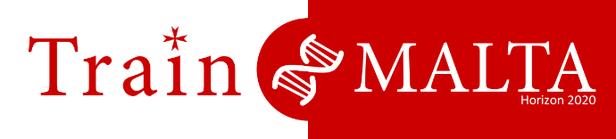

## Introduction to Unix and R

- Date: 26th July 2018, 9am - 1pm (CET)
- Course: [TrainMalta]((https://www.um.edu.mt/project/trainmalta)) Summer School 2018: [Epigenomics](https://www.um.edu.mt/project/trainmalta/notices/summerschool2018epigenomics)
- Location: Informatics Lab, University of Malta
- Trainers: Luigi Grassi, Daniel D'Andrea, Sergio Martínez Cuesta

### Plan for today

See [here](https://www.um.edu.mt/__data/assets/pdf_file/0006/358098/TrainMalta_SummerSchool_Programme-final.pdf)

### Additional materials

Unix:

- CRUK-CI Bioinformatics: [Introduction to the Shell](https://github.com/bioinformatics-core-shared-training/crukci-cluster-transition/blob/master/session1-shell.md)
