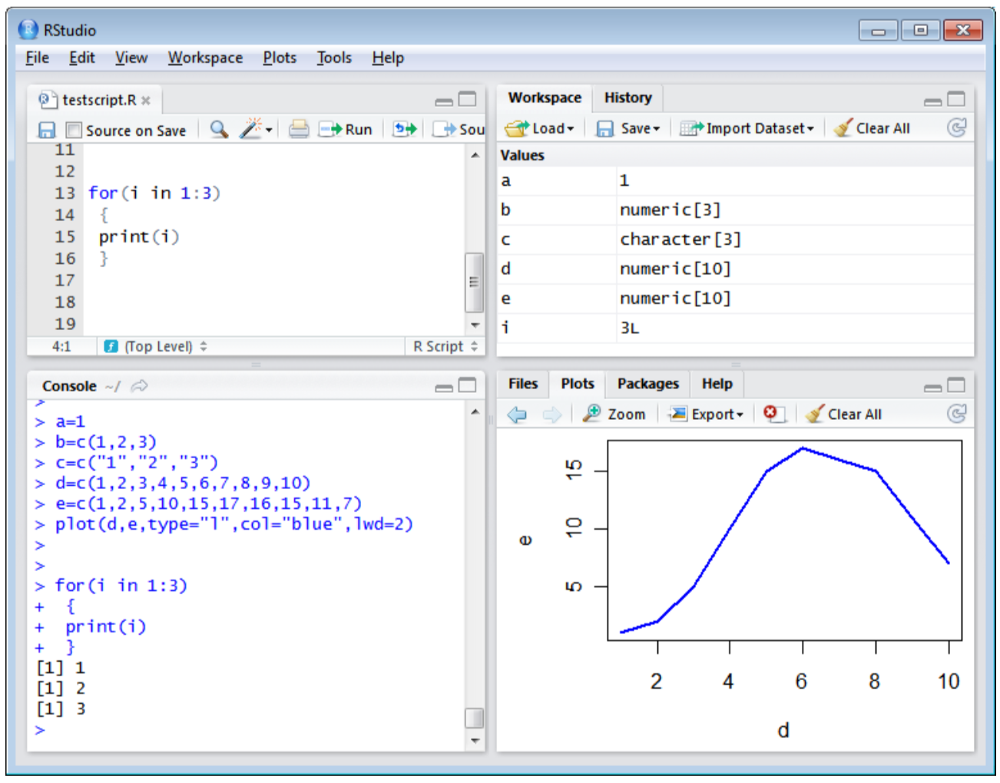

<p align="center">

</p>


# Introduction to Unix and R

- Date: 26th July 2018, 9am - 1pm (CET)
- Course: [TrainMalta](https://www.um.edu.mt/project/trainmalta) Summer School 2018: [Epigenomics](https://www.um.edu.mt/project/trainmalta/notices/summerschool2018epigenomics)
- Location: Informatics Lab, University of Malta
- Trainers:
  - Luigi Grassi, Department of Haematology, University of Cambridge (UK) Email: Luigi.grassi [at] bioresource.nihr.ac.uk
  - Daniel D'Andrea, Section of Inflammation and Signal Transduction, Imperial College London (UK) Email: d.dandrea [at] imperial.ac.uk
  - Sergio Martínez Cuesta, Department of Chemistry and CRUK-CI, University of Cambridge (UK) Email: sermarcue [at] gmail.com
- Today's [plan](https://www.um.edu.mt/__data/assets/pdf_file/0006/358098/TrainMalta_SummerSchool_Programme-final.pdf)
- We will be using the [etherpad](http://pad.software-carpentry.org/TrainMaltaSummerSchool2018) to exchange questions
- Materials for later sessions in the course: http://34.246.2.206:3000/


## Introduction to Unix

Based on:

- Grassi's Introduction to Unix and R, TrainMalta Summer School, 2016
- Pajon's [Introduction to the Shell](https://github.com/bioinformatics-core-shared-training/crukci-cluster-transition/blob/master/session1-shell.md)
- Software Carpentry's [The Unix Shell](http://swcarpentry.github.io/shell-novice/)


### Outline

- The structure of Unix: files and directories
- Exploring the command line
- Exercise 1
- Using Unix tools to explore files
- Downloading files from the internet
- Exercise 2
- Coffee break (10:00 - 10:30am)
- Compressing and archiving
- Locating files
- Text editors


### The structure of Unix: files and directories

Unix is made up of files and directories.

An example of a basic directory structure:

<p align="center">

</p>

It looks like a tree :evergreen_tree:!

- `/`: root directory
- `/bin`: basic system commands
- `/data`: storage of datasets
- `/Users`: user directories. Who? imhotep, larry and nelle e.g. `/Users/imhotep`
- `/tmp`: storage of temporary files

Examples of files: `README`, `.bashrc` and `index.html`

- Case sensitive: `README` is a different file from `readme`
- No length limit
- Can contain any character except `/` (including whitespaces)

A path is a sequence of nested directories with a file or directory at the end, separated by the `/` character.

- Absolute path e.g. `/Users/nelle/README`
- Relative path e.g. `nelle/README` (with respect to the current directory `/Users`)


### Exploring the command line and working with files

*What is the command line?* The tool used to execute *commands*, also known as instructions to tell the computer what to do.

In different contexts, the command line is often known as the terminal, shell, bash, console ...


#### How does the command line look like?

Open your command line:

<p align="center">
 
</p>

`$` indicates where you can start typing commands e.g. type the command `pwd`, then press Enter. This command helps you find where you are located in the directory structure. `pwd` displays the current directory ("**p**rint **w**orking **d**irectory").

Other useful basic commands are:

- `whoami`: who am I? what's my username?
- `hostname`: what is the name of the machine that am I am using now?


#### How can I list other directories?

- `ls`: lists directories available in the current directory

Commands can often take options, which help commands to be more specific. Options are defined with the `-` or `--` symbols.

- `ls -l`: provides additional info on files and directories
- `ls -la`: (options can be combined) this includes hidden files (.name)
- `ls -ltr`: with additional info and most recent files at the end
- `man ls`: open the manual about the command `ls` to look for more details about other options


#### How can I move up and down in the directory structure?

Use `cd` followed by the directory you want to go to, e.g. `cd Desktop` takes me to my Desktop (*Hint*: first run `ls` to find out which directories are available for you to visit).

If you want to move in the opposite direction:

- `cd ..`: moves one directory up
- `cd ../..`: moves two directories up (and so on)
- `cd` or `cd ~`: takes you to your home directory


#### How to create, copy, move or remove files and directories?

Create:

- `touch test.txt`: creates *file* `test.txt`
- `mkdir tmp`: creates *directory* `tmp`

(*Hint:* execute `ls -lh` to see how `test.txt` and `tmp` have been created)

Copy and move:

- `cp test.txt tmp/`: copies *file* `test.txt` inside *directory* `tmp`
- `mv test.txt tmp/`: moves *file* `test.txt` inside *directory* `tmp` (and removes it from the current directory)

Remove:

`rm` for *files* and `rm -r` for directories (:warning: With Great Power Comes Great Responsibility. When files or directories are deleted, there is no way back. They are totally gone forever.)

```bash
cd tmp/            # Go inside directory tmp/
rm test.txt        # Delete file test.txt
cd ..              # Move up one level in the directory tree
rm -r tmp/         # Delete directory tmp/ (here you can also use command rmdir)
```


### Exercise 1

- Click on this [link](https://zenodo.org/record/1320750/files/patient-data-cleaned.csv?download=1) to download the example dataset that we will be using this morning. This is a small made-up dataset which is often used for training purposes and contains information about 100 lung cancer patients aged 42-44 from different states in the US.
- Open the command line and navigate to find the exact directory where you downloaded `patient-data-cleaned.csv` (*Hint:* use `cd` to check in your home directory or in directories such as `Desktop/` or `Downloads/`)
- Now go to your home directory and create a new directory called `Unix_R`
- Copy the downloaded file `patient-data-cleaned.csv` from its current location to your newly created `Unix_R` directory

:tada: Congratulations! You did it! :thumbsup:

Other relevant commands and tricks:

- `history`: trace back your recent history of commands
- use the arrows UP and DOWN in your keyword to navigate through your history of commands
- wildcards: commands can use wildcards e.g. `*` to perform actions on more than one file at a time, e.g. `ls -l *.txt` lists all text files that end with txt
- use the TAB key to autocomplete paths and file names
- `ctrl` + `a`: cursor to beginning of command line
- `ctrl` + `e`: cursor to end of command line
- `ctrl` + `c`: stops the execution of a command


### Using Unix tools to explore files

There are many unix tools available, some are useful to explore files:

```bash
cd ~/Unix_R/

head patient-data-cleaned.csv       # Prints the top 10 lines
head -5 patient-data-cleaned.csv    # Prints the top 5 lines

tail patient-data-cleaned.csv       # Prints the bottom 10 lines
tail -2 patient-data-cleaned.csv    # Prints the bottom 2 lines

wc -l patient-data-cleaned.csv      # Counts the number of lines
wc -m patient-data-cleaned.csv      # Counts the number of characters

cat patient-data-cleaned.csv        # Prints all the contents in the file
less patient-data-cleaned.csv       # Browse through the contents in the file by pressing SPACE. Then click on Q to quit.

sort -n patient-data-cleaned.csv    # Sorts lines in numerical order
```

We can use the symbol `>` to **redirect** the output of some commands into a file, instead of printing it to the screen.

```bash
wc -l patient-data-cleaned.csv > number_patients.txt
cat number_patients.txt             # check the output
rm number_patients.txt              # remove file
```

You can search within files using the tool `grep`:

```bash
grep "California" patient-data-cleaned.csv
```

The **output** obtained using some commands can be used as **input** in other commands. Almost all of the standard Unix tools can work this way: unless told to do otherwise, they read **input**, do something with what they've read, and write to **output**. To combine commands, we use the vertical bar also known as **pipe** `|`. It tells the shell that we want to use the output of the command on the left as the input to the command on the right. E.g. we can count how many of the patients are from California by combining `grep` and `wc` as follows:

```bash
grep "California" patient-data-cleaned.csv | wc -l
```

The **output** of the `grep` command is the **input** of `wc -l`.

A more advanced tool to search within files is `awk`, which is actually a [programming language on its own](https://en.wikipedia.org/wiki/AWK). The general usage is `awk <options> '<code>' <files>`. For example, we can extend the `grep` functionality shown above like:

```bash
awk -F "," '($9=="California") {print $0}' patient-data-cleaned.csv
```

- `<options>`: `-F ","` (`patient-data-cleaned.csv` is a comma-separated value file)
- `'<code>'`: `'($9=="California") {print $0}'`, filter lines containing California in the 9th column, then print the entire line (`$0`)
- `<files>`: `patient-data-cleaned.csv`

```bash
awk -F "," '($9=="Louisiana") {print $5, $9, $11, $17}' patient-data-cleaned.csv
```


### Downloading files from the internet

The `wget` utility is the best option to **download files from the internet**. It retrieves files from the World Wide Web (WWW) using widely used protocols like HTTP, HTTPS and FTP, and is designed in such way so that it works in slow or unstable network connections. `wget` can automatically re-start a download where it was left off in case of network problem. Also it downloads file recursively and will keep trying until the file has be retrieved completely.

As an example on how to use `wget`, we are going to download a compressed raw sequencing file (FASTQ format) from a [wheat RNA-seq experiment](https://www.ebi.ac.uk/ena/data/view/ERX033526) hosted at EMBL-EBI:

```bash
cd ~/Unix_R/
wget ftp://ftp.sra.ebi.ac.uk/vol1/fastq/ERR056/ERR056477/ERR056477.fastq.gz
```

You can use commands such as `zcat` and `head` to inspect the file:

```bash
zcat < ERR056477.fastq.gz | head
```


### Exercise 2

- Use pipes to find out how many patients from Florida are Male and how many are Female in the `patient-data-cleaned.csv` dataset
- Download the sequencing data from a replicate RNA-seq experiment (ftp://ftp.sra.ebi.ac.uk/vol1/fastq/ERR056/ERR056478/ERR056478.fastq.gz) and concatenate `ERR056477.fastq.gz` and `ERR056478.fastq.gz` to produce a new combined file (*Hint:* use `cat`)

:tada: Well done! :thumbsup:


### Compressing and archiving

#### How much space do I use?

The command line tools `du` and `df` are useful to measure disk usage:

```bash
cd ~
du -h Unix_R            # Size of the directory

cd Unix_R
du -h *.fastq.gz        # Size of individual files

df -h /                 # Space that I use in the system
```

#### How to compress and uncompress files and directories?

Compressed files with extension `.gz` can be uncompressed with the tool `gzip`. Let's uncompress one of the fastq files:

```bash
cd ~/Unix_R
gzip -d ERR056477.fastq.gz    # The option -d uncompresses files
ls -lh
head ERR056477.fastq
gzip ERR056477.fastq          # Now we compress it back
ls -lh
```

Similarly, zipped files (extension `.zip`) can be uncompressed with the tool `unzip`. The tool [tar](https://kb.iu.edu/d/acfi) is also widely-used to build data archives and backups.


### Locating files

The tool `find` is useful to search for files of unknown location (they may not have been used for some time):

```bash
cd ~
find . -name "*.fastq.gz"
find . -name "patient-data*"
find . -name "README"
```


### Text editors

Graphical:

- Recent:
  - [Atom](https://atom.io/): free and open source; macOS, Linux and Windows; lots of free extension packages built and maintained by the community; supports most programming languages; developed by GitHub
  - [PyCharm](https://www.jetbrains.com/pycharm/): free and open source; macOS, Linux and Windows; specifically for the Python programming language; professional edition with extra features released under a proprietary license; developed by JetBrains.

- Classic:
  - [Gedit](https://wiki.gnome.org/Apps/Gedit): free and open source; macOS, Linux and Windows; simple and easy to use
  - [Emacs](https://www.gnu.org/software/emacs/): one of the oldest free open source projects still under development
  - [Kate](https://kate-editor.org/): intended for software developers

Text-only:

- [nano](https://www.nano-editor.org/)
- [vi](https://en.wikipedia.org/wiki/Vi)


Any questions? :thought_balloon: :thought_balloon: :thought_balloon:


## Introduction to R and ggplot2

This is based on the [R crash course](https://github.com/bioinformatics-core-shared-training/r-crash-course) developed by [Mark Dunning](https://github.com/markdunning) and [Laurent Gatto](https://github.com/lgatto).


### Outline

- Motivation
- How can I find help?
- Getting started
- Variables and functions
- Exercise 4
- Vectors
- Import and explore data
- Subsetting
- Exercise 5
- Sort tables and export results
- Basic plotting
- Exercise 6
- Advanced plotting using the ggplot2 library
- Export graphics


### Motivation

- R is one of the most widely-used programming languages for data analysis, statistics and visualisation in academia and industry.
- It is free, open source and available in all platforms (macOS, Linux and Windows)
- Supported by a broad community of software developers and researchers who contribute R packages and libraries to many fields of research
- It facilitates reproducibility in research and integration of all your analyses in individual scripts
- Easy to write documentation and code together using a free environment like [RStudio](https://www.rstudio.com/)

E.g. The New Zealand [Tourism Dashboard](https://mbienz.shinyapps.io/tourism_dashboard_prod/) uses R extensively to report statistics.


### How can I find help?

- [Stack Overflow](https://stackoverflow.com/)
- The Comprehensive R Archive Network ([CRAN](https://cran.r-project.org/))
- [CRAN Task Views](https://cran.r-project.org/web/views/)
- [R-bloggers](https://www.r-bloggers.com/)
- [Quick-R](https://www.statmethods.net/)
- Local R groups
- Type `?` followed my the name of the function that you'd like to use, e.g. `?mean`
- [Bioconductor](https://www.bioconductor.org/)
- [Biostars](https://www.biostars.org/)


### Getting started

- Open RStudio and explore the different panels

<p align="center">

</p>

- RStudio interface is composed of four panels, in anti-clockwise sense:
  - Top-left: scripts panel
  - Bottom-left: R console
  - Bottom-right: plots, packages and help
  - Top-right: log panel

- The scripts panel is used to write commands whereas the R console below is used to interact with the programming language.
- Click on `File` -> `New File` -> `R Script` to open up a page where to record R commands
- Save it as e.g. `myScript.R` in your preferred scripts location


### Variables and functions

You can use R as a calculator using the symbols `+`, `-`, `*` and `/`, or more advanced features such as statistical operations, logarithms, trigonometry ...

```{r eval=FALSE}
2 + 1
7 - 1
3 * 2
10 / 5

mean(1:5)
log(1)
pi
sin(pi/2)
```

To store your results for later, use **variables**. To create them, use the assignment operator `<-`:

```{r eval=FALSE}
x <- 25
x
y <- 16
y
```

You can perform multiple operations using variables:

```{r eval=FALSE}
sqrt(x)
x + y
x <- 36
x <- y
x <- x + 8
```

**Functions** in R take one or more *arguments* as input, which are captured using parentheses. Arguments can be named explicitly, otherwise they are meant to be used in the same order as described in the function definition. E.g. `seq` is a function for generating a numeric sequence *from* and *to* particular numbers. Type `?seq` to get the help page for this function.

```{r eval=FALSE}
?seq
seq(from = 1, to = 10, by = 2)
seq(1, 10, 2)
```

Some functions have *default* values in some arguments:

```{r eval=FALSE}
seq(1, 10, 1)
seq(1, 10)
```

The default value for the `by` argument in the `seq()` function is 1.

An alternative method to obtain sequences of numbers spaced by one value is the `:` symbol:

```{r eval=FALSE}
z <- 1:5
z
```


#### Exercise 4

Work in pairs, meet the person sitting next to you and try the following together (3 min):

- Create a sequence of numbers from 10 to 30 spaced by three values
- How about decreasing sequences? Now try from 30 to 10 spaced by three values  (hint: check `?seq`)
- Round the number `pi` down to 1 decimal place (hint: check `?round`)

```{r}


```


## Additional materials

Unix:

- Software Carpentry: [The Unix Shell](http://swcarpentry.github.io/shell-novice/)
- Data Carpentry: [Introduction to the command line](https://datacarpentry.org/shell-genomics/)
- CRUK-CI Bioinformatics: [Introduction to the Shell](https://github.com/bioinformatics-core-shared-training/crukci-cluster-transition/blob/master/session1-shell.md)
- Babraham: [Introduction to Unix](https://www.bioinformatics.babraham.ac.uk/training.html#unix)
- Linux [Cheat Sheet](https://files.fosswire.com/2007/08/fwunixref.pdf)

R:

- Software Carpentry: [Programming with R](http://swcarpentry.github.io/r-novice-inflammation/)
- Software Carpentry: [R for Reproducible Scientific Analysis](http://swcarpentry.github.io/r-novice-gapminder/)
- Data Carpentry: [Data analysis and visualization in R](https://datacarpentry.org/R-genomics/)
- Babraham: [Introduction to R](https://www.bioinformatics.babraham.ac.uk/training.html#rintro)
- Torfs and Brauer: [A (very) short introduction to R](https://cran.r-project.org/doc/contrib/Torfs+Brauer-Short-R-Intro.pdf)
- R and RStudio [Cheat Sheets](https://www.rstudio.com/resources/cheatsheets/)
