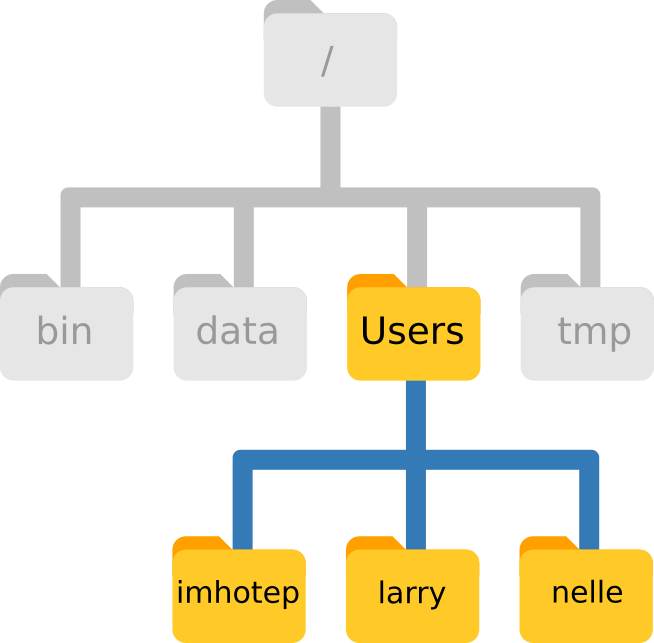
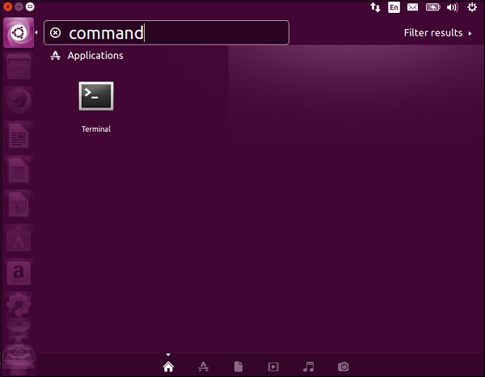
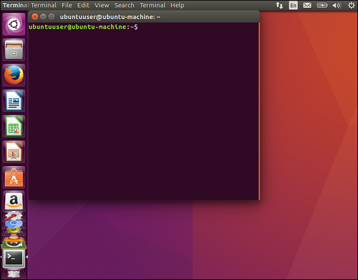

<p align="center">

</p>


# Introduction to Unix and R

- Date: 26th July 2018, 9am - 1pm (CET)
- Course: [TrainMalta](https://www.um.edu.mt/project/trainmalta) Summer School 2018: [Epigenomics](https://www.um.edu.mt/project/trainmalta/notices/summerschool2018epigenomics)
- Location: Informatics Lab, University of Malta
- Trainers:
  - Luigi Grassi, Department of Haematology, University of Cambridge (UK) Email: Luigi.grassi [at] bioresource.nihr.ac.uk
  - Daniel D'Andrea, Section of Inflammation and Signal Transduction, Imperial College London (UK) Email: d.dandrea [at] imperial.ac.uk
  - Sergio Martínez Cuesta, Department of Chemistry and CRUK-CI, University of Cambridge (UK) Email: sermarcue [at] gmail.com
- Today's [plan](https://www.um.edu.mt/__data/assets/pdf_file/0006/358098/TrainMalta_SummerSchool_Programme-final.pdf)
- We will be using the [etherpad](http://pad.software-carpentry.org/TrainMaltaSummerSchool2018)


## Introduction to Unix

(Based on materials from Luigi Grassi's Introduction to Unix and R, TrainMalta Summer School 2016 and others)


### Outline

- The structure of Unix: files and directories
- Exploring the command line and working with files
- Exercise 1

- Unix tools


- Users and permissions
- Standard input/output, redirections, pipes
- Task control
- Environment variables and bashrc
- Text editor (nano)
- Compressing and archiving
- Locating files


### The structure of Unix: files and directories

Unix is made up of files and directories.

An example of a basic directory structure:

<p align="center">

</p>

It looks like a tree :evergreen_tree:!

- `/`: root directory
- `/bin`: basic system commands
- `/data`: storage of datasets
- `/Users`: user directories. Who? imhotep, larry and nelle e.g. `/Users/imhotep`
- `/tmp`: storage of temporary files

Examples of files: `README`, `.bashrc` and `index.html`

- Case sensitive: `README` is a different file from `readme`
- No length limit
- Can contain any character except `/` (including whitespaces)

A path is a sequence of nested directories with a file or directory at the end, separated by the `/` character.

- Absolute path e.g. `/Users/nelle/README`
- Relative path e.g. `nelle/README` (with respect to the current directory `/Users`)


### Exploring the command line and working with files

*What is the command line?* The tool used to execute *commands*, also known as instructions to tell the computer what to do.

In different contexts, the command line is often known as the terminal, shell, bash, console ...


#### How does the command line look like?

Open your command line:

<p align="center">
 
</p>

`$` indicates where you can start typing commands e.g. type the command `pwd`, then press Enter. This command helps you find where you are located in the directory structure. `pwd` displays the current directory ("**p**rint **w**orking **d**irectory").

Other useful basic commands are:

- `whoami`: who am I? what's my username?
- `hostname`: what is the name of the machine that am I am using now?


#### How can I list other directories?

- `ls`: lists directories available in the current directory

Commands can often take options, which help commands to be more specific. Options are defined with the `-` or `--` symbols.

- `ls -l`: provides additional info on files and directories
- `ls -la`: (options can be combined) this includes hidden files (.name)
- `ls -ltr`: with additional info and most recent files at the end
- `man ls`: open the manual about the command `ls` to look for more details about other options


#### How can I move up and down in the directory structure?

Use `cd` followed by the directory you want to go to, e.g. `cd Desktop` takes me to my Desktop (*Hint*: first run `ls` to find out which directories are available for you to visit).

If you want to move in the opposite direction:

- `cd ..`: moves one directory up
- `cd ../..`: moves two directories up (and so on)
- `cd` or `cd ~`: takes you to your home directory


#### How to create, copy, move or remove files and directories?

Create:

- `touch test.txt`: creates *file* `test.txt`
- `mkdir tmp`: creates *directory* `tmp`

(*Hint:* execute `ls -lh` to see how `test.txt` and `tmp` have been created)

Copy and move:

- `cp test.txt tmp/`: copies *file* `test.txt` inside *directory* `tmp`
- `mv test.txt tmp/`: moves *file* `test.txt` inside *directory* `tmp` (and removes it from the current directory)

Remove:

`rm` for *files* and `rm -r` for directories (**Important**:exclamation: Think twice before executing any `rm` command or the files and directories may be gone forever)

```bash
cd tmp/            # Go inside directory tmp/
rm test.txt        # Delete file test.txt
cd ..              # Move up one level in the directory tree
rm -r tmp/         # Delete directory tmp/ (here you can also use command rmdir)
```

Other relevant commands and tricks:

- `history`: trace back your recent history of commands
- use the arrows UP and DOWN in your keyword to navigate through your history of commands
- wildcards: commands can use wildcards e.g. `*` to perform actions on more than one file at a time, e.g. `ls -l *.txt` lists all text files that end with txt


### Exercise 1

- Click on this [link](https://zenodo.org/record/1319994/files/patient-data-cleaned.csv?download=1) to download the example dataset that we will be using this morning. This is a small made-up dataset which is often used for training purposes and contains information about 100 lung cancer patients aged 42-44 from different states in the US.
- Use the command line to find the exact directory where you downloaded `patient-data-cleaned.csv` (*Hint:* use `cd` to check in your home directory or in directories such as `Desktop/` or `Downloads/`)
- Now go to your home directory and create a new directory called `Unix_R`
- Copy the file `patient-data-cleaned.csv` from its current location to your newly created `Unix_R` directory


### Unix tools


## Introduction to R and ggplot2

https://github.com/semacu/20180315_IntroductionToR_Wolfson_Cambridge/blob/master/README.Rmd

https://github.com/semacu/20180531_DataVisualisationRggplot2_Wolfson_Cambridge/blob/master/README.Rmd


## Additional materials

Unix:

- Sofware Carpentry: [The Unix Shell](http://swcarpentry.github.io/shell-novice/)
- Data Carpentry: [Introduction to the command line](https://datacarpentry.org/shell-genomics/)
- CRUK-CI Bioinformatics: [Introduction to the Shell](https://github.com/bioinformatics-core-shared-training/crukci-cluster-transition/blob/master/session1-shell.md)
- Babraham: [Introduction to Unix](https://www.bioinformatics.babraham.ac.uk/training.html#unix)

R:

- Sofware Carpentry: [Programming with R](http://swcarpentry.github.io/r-novice-inflammation/)
- Sofware Carpentry: [R for Reproducible Scientific Analysis](http://swcarpentry.github.io/r-novice-gapminder/)
- Data Carpentry: [Data analysis and visualization in R](https://datacarpentry.org/R-genomics/)
- Babraham: [Introduction to R](https://www.bioinformatics.babraham.ac.uk/training.html#rintro)
